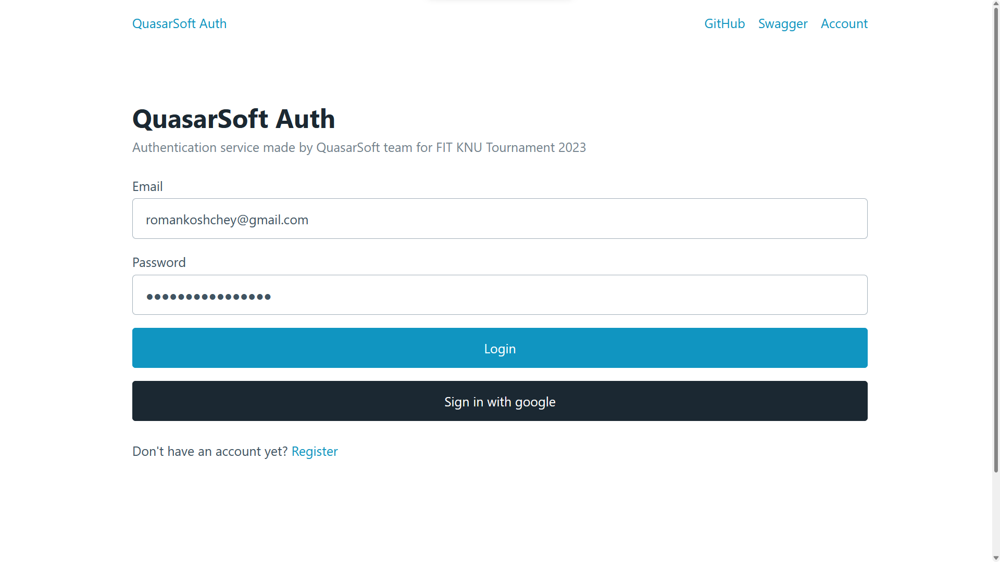
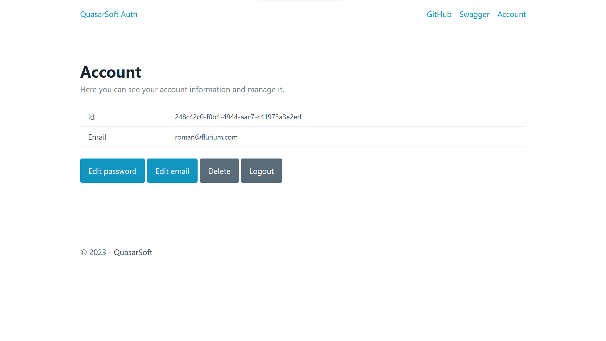
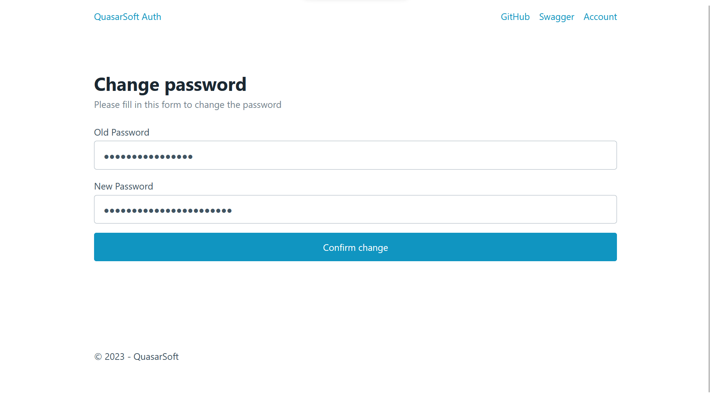
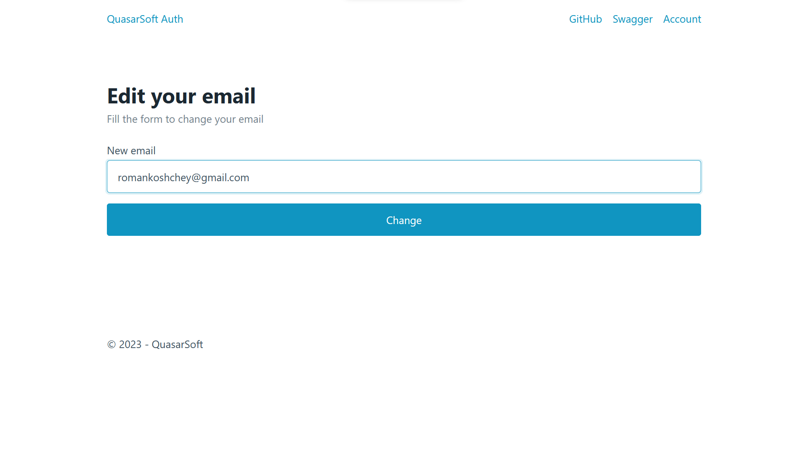
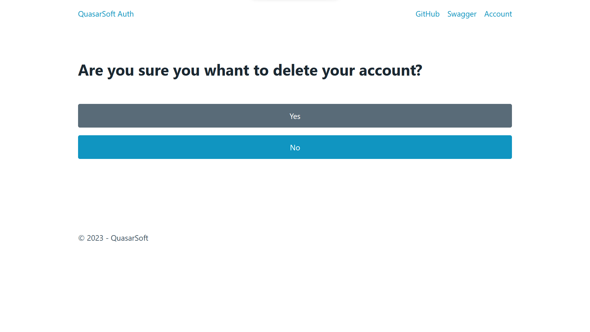
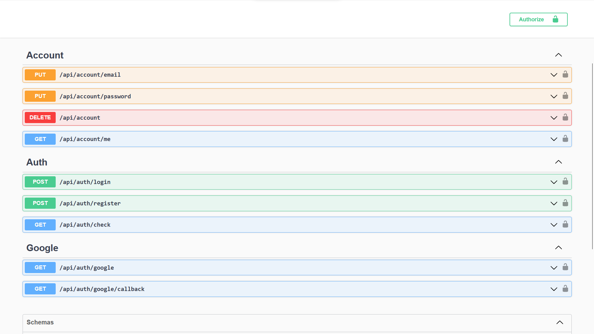

# Звіт

Тема: Сервіс для авторизації користувачів

Мета: розробити сервіс для авторизації на .NET за 2 дні

## Розробники:

Всі рохробники вчаться у групі ІПЗ-12 на момент створення.

- Кощей Роман Віталійович (тім лід)
- Старосівець Богдан Володимирович
- Деркач Ростислав Олександрович
- Коріневський Роман Сергійович

У файлі [task.pdf](./task.pdf) можна детально подивитися завдання.

## Вимоги

Вимоги:

1. Реєстрація користувачів: Користувачі повинні мати можливість створити обліковий
   запис, використовуючи електронну пошту, Google акаунт.

2. Авторизація користувачів: Користувачі повинні мати можливість увійти в систему,
   використовуючи використаний раніше метод авторизації.

3. Управління авторизаційними методами: Користувачі повинні мати можливість
   змінювати та видаляти особисті дані: паролі та пошту (якщо користувачем було обрано
   варіант авторизації через пошту). Мають підтримуватися CRUD-операції. Додаткове
   завдання: крім функції видалення користувача додати функції деактивації та повторної
   активації профіля.

4. Захист інформації: Усі авторизаційні дані, такі як паролі або токени, повинні бути
   збережені в безпечному і шифрованому вигляді.

5. API для інших сервісів: Ваш сервіс повинен надавати API, за допомогою якого інші
   сервіси можуть реєструвати нових користувачів, перевіряти валідність авторизаційних
   даних та видаляти існуючі записи користувачів.

6. Інтерфейс користувача (опціонально): Якщо ви розробляєте інтерфейс для реєстрації
   та управління авторизаційними методами, він повинен бути зрозумілим та зручним для
   використання.

## Результат

Проект розгорнутий на [fit-knu-tournament.onrender.com](https://fit-knu-tournament.onrender.com/).
Тож з ним можно ознайомитися самостій.

Декілька скріншотів з роботи сервіса:

Swagger сторінка:

## Розподіл роботи

### Кощей Роман

Як Team Lead відповідав за:

- Загальну архітектуру проекту
- Дизайн бази данних та взаємодії з нею
- Middleware для токенів та авторизації
- Docker та розгортання на сервері

### Старосівець Богдан Володимирович

Відповідав за:

- Головні шляхи API
- UI та взаємодію з MVC
- Google авторизацію

### Деркач Ростислав Олександрович

Відповідав за:

- UI
- API документація

### Коріневський Роман Сергійович

Відповідав за:

- Документація коду
- API документація
